## Node.js超入門

安部裕太

---

## 本日の内容

---

## Webページのオブジェクト

+++?code=A-16.html
@[10](ロードし終わったら関数を実行)
@[14](クリックすると関数を実行)

+++?code=A-17.js
@[5,6](それぞれのidのタグを操作するオブジェクトを取り出す)
@[7,11](textContentの値を変更することによって表示するテキストを変更できる)

+++
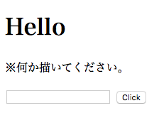

+++
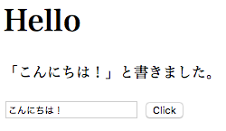

+++

### イベントとは？
- onclickやonloadをイベントと言う |
- イベントを使うことによって操作や動作に応じて処理を実行できる |

+++?code=A-18.js

+++
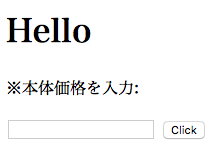

+++
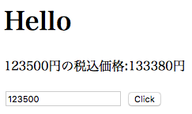

+++
### まとめ
- どのような時にイベントを使うか？ |
 - 操作や動作に応じて処理を実行したい時 |
- なんと言うプロパティを変更することによってテキストを変更することができるか？ |
 - textContent |

---
## データのやり取りをマスターしよう

+++
### クエリーパラメーター
- URLの後ろに付いていることがある「?」から始まる文字列　|
- 必要な値をサーバーに渡すことができる |

+++?code=3-1.js
@[19](第二引数にtrueを追加)
@[24](クエリーパラメーターのオブジェクトを保管)
@[25](msgが未定義の場合を考慮する！)

+++
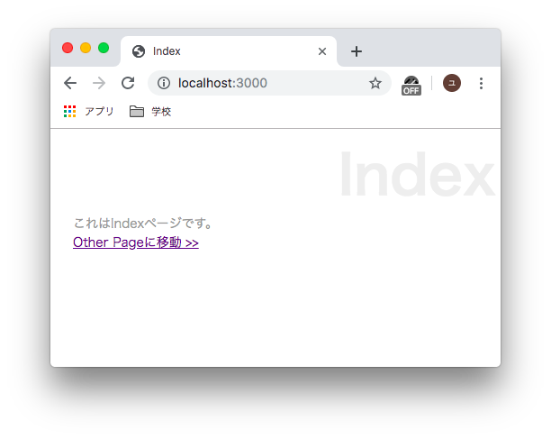

+++
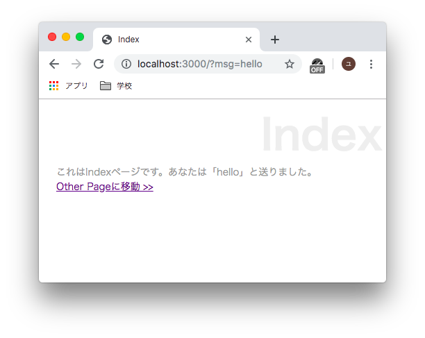

+++
### フォームの送信を行う
フォームの送信手順
1. 送られたフォームのデータを受け取る
1. 受け取ったデータをパースする
1. 必要な値を取り出して処理をする

+++?code=3-2.ejs
@[17](POST送信ができるようにしている)

+++?code=3-3.js
@[5](Query Stringモジュール取得)
@[59](POST送信されたかをチェック)
@[63,68](イベント処理)
@[63](データ受け取り時に発生)
@[68](データ受け取り完了時に発生)
@[60,63,64,65]()
@[69](エンコードする)

+++
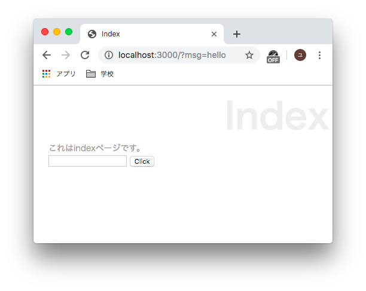

+++
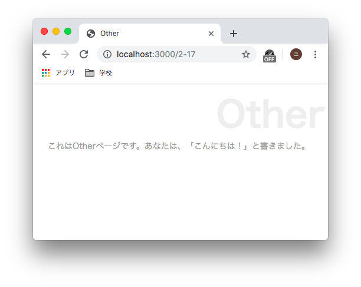

+++?code=3-4.js

+++?code=3-5.css

+++
```
<p><table> 
   <% for(var key in data){ %>
   <tr>
   <th><%= key%></th>
   <td><%= data[key]%></td>
   </tr>
   <% } %>
   </table></p>
```

+++
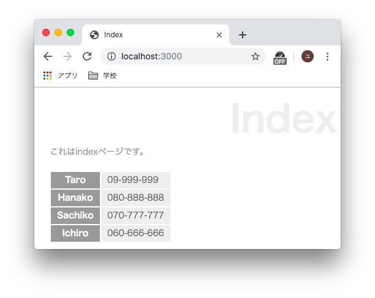

+++
### まとめ
- エンコードするためにrequireするものは？
 - querystring |
- データ受け取り時とデータ受け取り完了時にイベントを発生させるものは？
 - data,end |
- テンプレート側で処理を実行したい場合は？
 - <% %> |

---
## パーシャル、アプリケーション、クッキー

+++?code=3-7.ejs

+++?code=3-8.ejs

+++?code=3-9.js

+++


+++
```
<tr>
    <table>
        <tr>
            <th><%= key%></th>
        </tr>

    </table>
</tr>
```
@[6,10]()

+++?code=3-11.js

+++
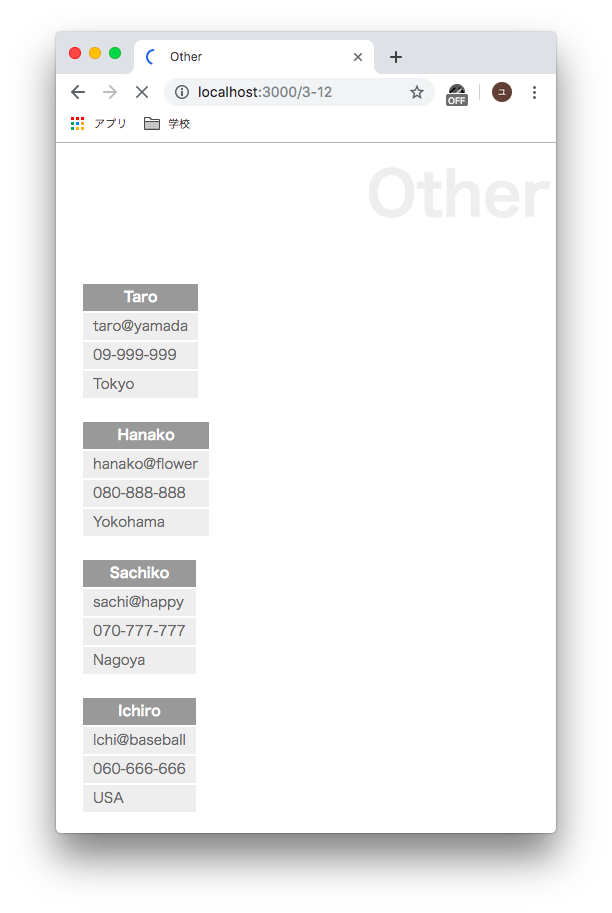

+++code?=3-12.ejs

+++code?=3-13.ejs

+++code?=3-14.js

+++
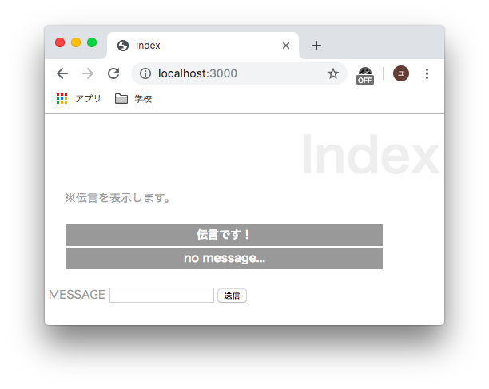

+++


+++
### まとめ


